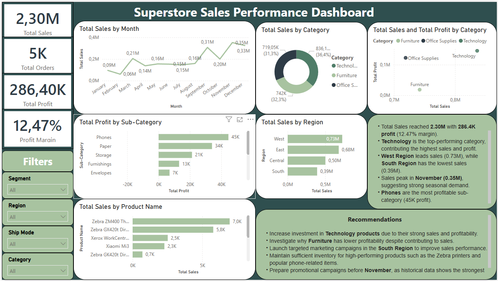

# FUTURE_DS_01
# 📊 Superstore Sales Performance Dashboard

## 📌 Project Overview

This project analyzes Superstore sales data to identify revenue trends, top-performing products, profitable categories, and regional sales performance. The dashboard was developed as part of the Future Interns Data Science & Analytics Internship (Task 1).

The objective is to transform raw sales data into actionable business insights that support data-driven decision-making.

---

## 🎯 Project Objectives

- Analyze overall sales and profit performance
- Identify top-performing product categories
- Evaluate regional sales performance
- Track monthly sales trends
- Discover the most profitable products and sub-categories
- Generate actionable business recommendations

---

## 🛠 Tools Used

- Power BI
- Microsoft Excel
- Data Cleaning & Transformation
- DAX Measures

---

## 📈 Dashboard KPIs

- Total Sales: **2.30M**
- Total Orders: **5K**
- Total Profit: **286.40K**
- Profit Margin: **12.47%**

---

## 📊 Dashboard Features

### Sales Trend Analysis
- Monthly sales performance visualization
- Identification of peak and low sales periods

### Category Performance
- Total sales by category
- Sales vs Profit comparison

### Regional Analysis
- Sales performance across regions
- Best and worst performing regions

### Product Analysis
- Top-selling products
- Most profitable sub-categories

### Interactive Filters
Users can filter data by:
- Segment
- Region
- Ship Mode
- Category

---

## 🔍 Key Insights

- Total Sales reached **2.30M** with **286.4K Profit**.
- **Technology** is the highest-performing category in terms of sales and profit.
- **West Region** generated the highest sales.
- **South Region** recorded the lowest sales performance.
- Sales peaked during **November**, indicating strong seasonal demand.
- **Phones** emerged as the most profitable sub-category.

---

## 💡 Recommendations

1. Increase investment in Technology products due to strong profitability.
2. Investigate factors affecting Furniture profitability.
3. Implement targeted marketing campaigns in the South Region.
4. Maintain inventory levels for high-demand products.
5. Launch promotional campaigns before November to maximize seasonal sales.

---

## 📷 Dashboard Preview

(Add a screenshot of your dashboard here)



---

## 📂 Repository Structure

```
FUTURE_DS_01
│
├── Dataset
├── PowerBI Dashboard (.pbix)
├── Dashboard Screenshot
├── README.md
└── Project Documentation
```

---

## 🚀 Skills Demonstrated

- Data Cleaning
- Data Visualization
- Business Analytics
- KPI Analysis
- Dashboard Design
- Insight Generation
- Power BI
- DAX

---

## 👨‍💻 Author

**Cesky Fhulufhelo Nengudza**

BSc Applied Mathematics  
Walter Sisulu University

Email: ceskyakeelah@gmail.com

LinkedIn: www.linkedin.com/in/cesky-nengudza

---

## 🏆 Future Interns – Data Science & Analytics

Task 1: Business Sales Performance Analytics

This project demonstrates the application of data analytics techniques to solve real-world business problems through interactive dashboard development and insight generation.

